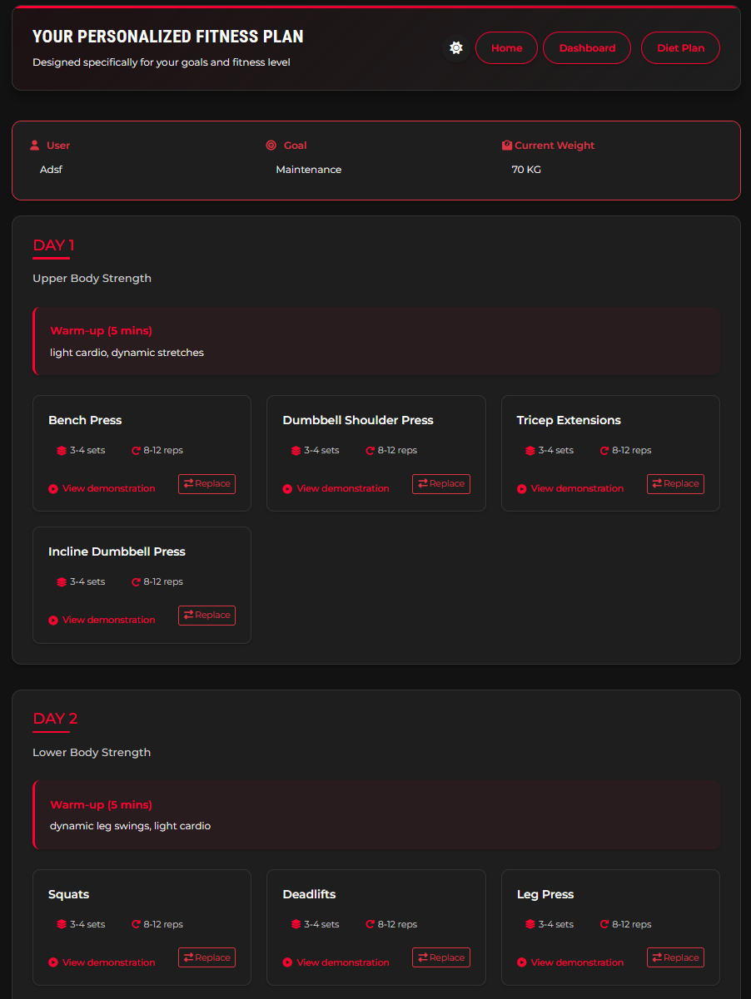

#  Liftology

<div align="center">


[](https://github.com/yourusername/Liftology/releases)
[](LICENSE)
[](Documentation/)

</div>

##  Overview

Liftology is an intelligent fitness platform that leverages artificial intelligence to provide personalized workout and nutrition guidance. Our system combines multiple AI services to create a comprehensive fitness solution.

##  Platform Preview

<div align="center">

###  Main Dashboard

*Main dashboard showing workout progress and recommendations*

###  Exercise Planning

*AI-powered exercise planning interface*

###  Diet Recommendations

*Personalized diet recommendations and meal planning*

###  Technique Analysis


*Real-time exercise form analysis and feedback*

</div>

##  Core Services

###  Exercise Plan Recommender
- AI-driven workout planning
- Performance tracking
- Exercise history analysis

###  Diet Plan Recommender
- Personalized nutrition plans
- Calorie and macro tracking
- Dietary restriction support
- Meal suggestions

###  Technique Detection
- Real-time form analysis
- Exercise correction

###  Chatbot Assistant
- 24/7 fitness guidance
- Exercise explanations
- Nutrition advice

## Tech Stack

###  Backend Infrastructure
- FastAPI for API development
- MongoDB for data storage
- Railway for deployment
- Python for core services

###  AI Components
- Machine learning models for exercise analysis
- Natural language processing for chatbot
- Computer vision for technique detection
- Recommendation systems for planning

##  Getting Started

###  Prerequisites
- Python 3.8+
- MongoDB
- Node.js 16+

### Installation

1. Clone the repository
```bash
git clone https://github.com/yourusername/Liftology.git
cd Liftology
```

2. Set up the backend
```bash
cd Backend
pip install -r requirements.txt
uvicorn main:app --reload
```

3. Configure the frontend
```bash
cd Front\ End
npm install
npm start
```

4. Initialize AI services
```bash
# Start each service in separate terminals
cd Exercise\ Plan\ Recommender
python main.py

cd Diet\ Plan\ Recommender
python main.py

cd Technique\ Detection\ Service
python main.py

cd Chatbot\ Service
python main.py
```

##  Project Structure

```
Liftology/
├── Front End/                # Web interface
├── Backend/                 # API services
├── Exercise Plan Recommender/  # Workout AI
├── Diet Plan Recommender/   # Nutrition AI
├── Technique Detection Service/ # Form analysis
├── Chatbot Service/        # AI assistant
└── Documentation/          # Project docs
```

##  Documentation

Detailed documentation for each component is available in the [Documentation](Documentation/) directory:

- [System Architecture](Documentation/architecture.md)
- [API Reference](Documentation/api.md)
- [User Guide](Documentation/user-guide.md)
- [Development Guide](Documentation/development.md)

##  Development Team

- Abdelrahman Mohamed
- Mahmoud Taha
- Mohamed Motaz
- Mostafa Adel
- Osama Ahmed

##  License

This project is licensed under the MIT License - see the [LICENSE](LICENSE) file for details.

---

<div align="center">

 **Made with love by the Liftology Team** 

</div> 